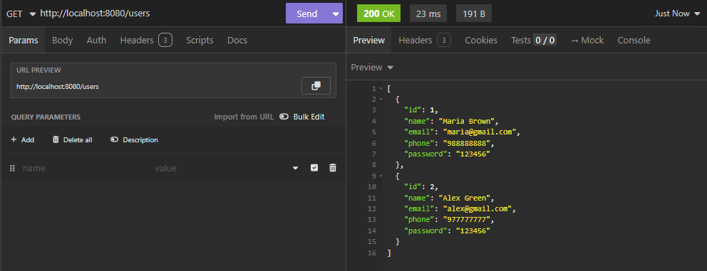
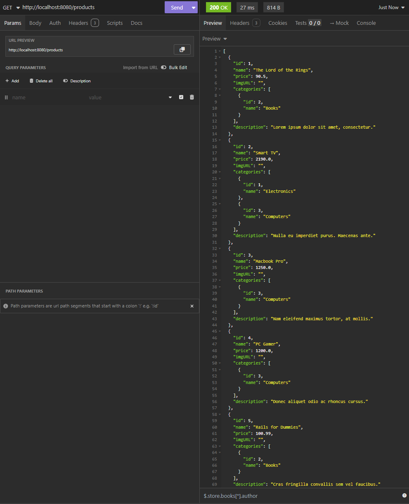
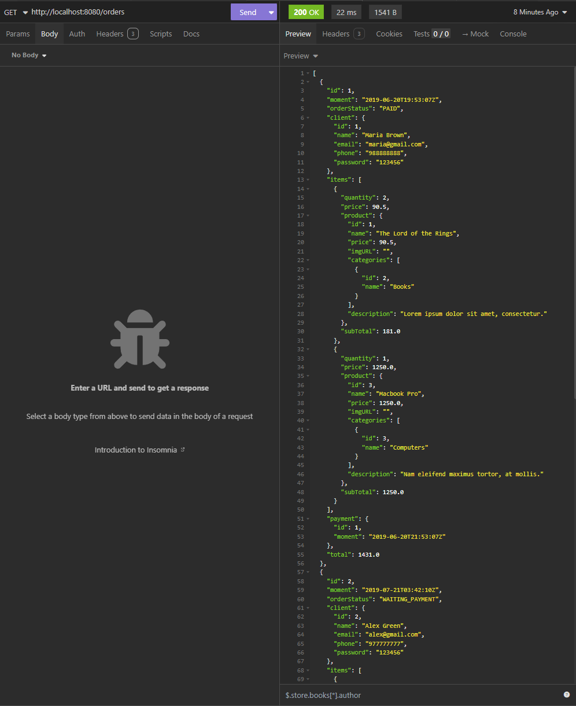
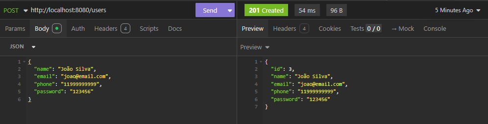
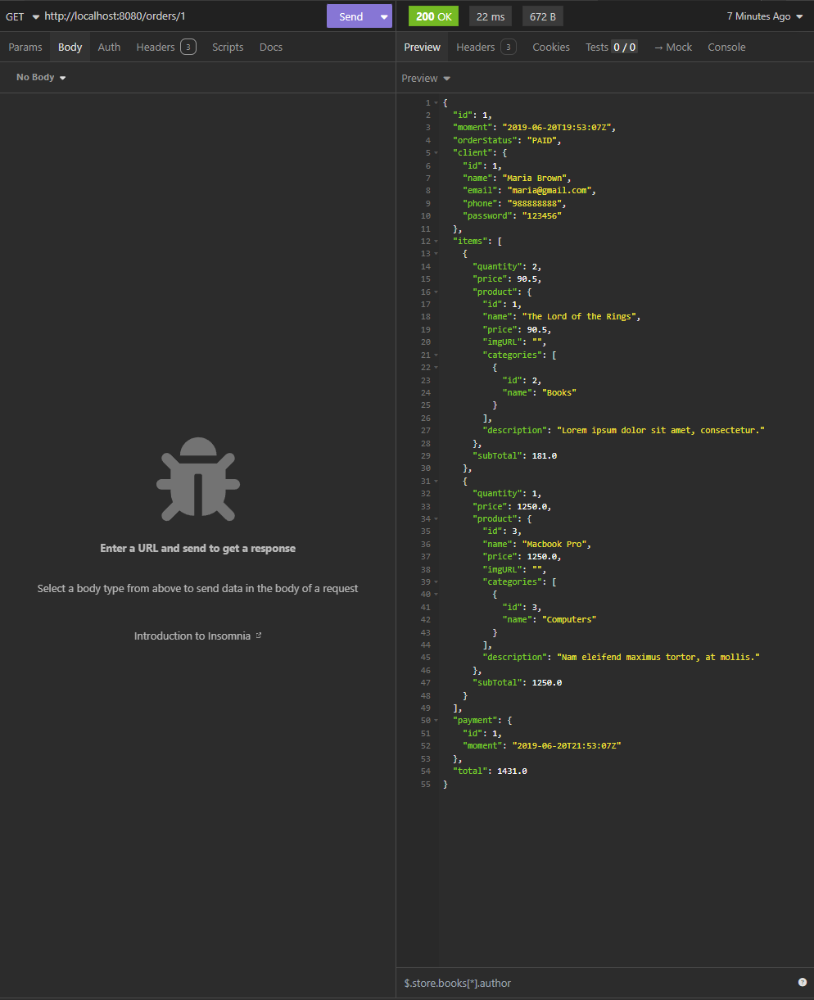
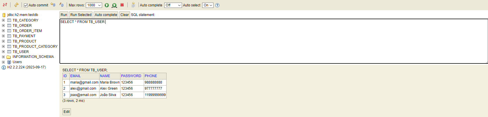

# 🛒 E-Commerce Web Service - Spring Boot & JPA/Hibernate

[](https://www.oracle.com/java/)
[](https://spring.io/projects/spring-boot)
[](https://maven.apache.org/)
[](https://www.h2database.com/)
[](https://www.postgresql.org/)

> **Project developed by Fábio M. Valente** as part of Prof. Nélio Alves' Java course

## 📋 About the Project

This is a **complete RESTful Web Service** for an e-commerce system, built with **Spring Boot 3** and **JPA/Hibernate**. The project implements all CRUD operations and demonstrates advanced Java enterprise development concepts.

### 🎯 Learning Objectives

- ✅ RESTful API development with Spring Boot
- ✅ Object-relational mapping with JPA/Hibernate
- ✅ Entity relationships (One-to-Many, Many-to-Many)
- ✅ Exception handling and validations
- ✅ Profile configuration (development/test/production)
- ✅ H2 and PostgreSQL database integration

## 🏗️ System Architecture

```
📦 com.aulaSpring.webservice
├── 📂 entities/          # JPA Entities
├── 📂 repositories/      # Spring Data Repositories
├── 📂 services/          # Service Layer
├── 📂 resources/         # REST Controllers
├── 📂 config/            # Configurations
└── 📂 exceptions/        # Exception Handling
```

## 🗃️ Data Model

### Main Entities:
- **👤 User**: System users
- **📦 Product**: Catalog products
- **🛒 Order**: Placed orders
- **🏷️ Category**: Product categories
- **💳 Payment**: Order payments
- **📋 OrderItem**: Order items

### Relationships:
- User ↔ Order (One-to-Many)
- Order ↔ OrderItem (One-to-Many)
- Product ↔ OrderItem (One-to-Many)
- Product ↔ Category (Many-to-Many)
- Order ↔ Payment (One-to-One)

## 🚀 Technologies Used

| Technology | Version | Description |
|------------|---------|-------------|
| **Java** | 21 LTS | Programming language |
| **Spring Boot** | 3.3.11 | Main framework |
| **Spring Data JPA** | 3.3.11 | Data persistence |
| **Hibernate** | 6.5.3 | ORM (Object-Relational Mapping) |
| **H2 Database** | 2.2.224 | In-memory database (development) |
| **PostgreSQL** | 42.7.5 | Production database |
| **Maven** | 3.9.9 | Dependency management |

## 📡 API Endpoints

### 👥 Users
```http
GET    /users          # List all users
GET    /users/{id}     # Find user by ID
POST   /users          # Create new user
PUT    /users/{id}     # Update user
DELETE /users/{id}     # Delete user
```

### 📦 Products
```http
GET    /products       # List all products
GET    /products/{id}  # Find product by ID
POST   /products       # Create new product
PUT    /products/{id}  # Update product
DELETE /products/{id}  # Delete product
```

### 🛒 Orders
```http
GET    /orders         # List all orders
GET    /orders/{id}    # Find order by ID
POST   /orders         # Create new order
PUT    /orders/{id}    # Update order
DELETE /orders/{id}    # Delete order
```

### 🏷️ Categories
```http
GET    /categories     # List all categories
GET    /categories/{id} # Find category by ID
POST   /categories     # Create new category
PUT    /categories/{id} # Update category
DELETE /categories/{id} # Delete category
```

## 🖼️ Application Screenshots

### 📊 API Endpoints Tested with Insomnia

#### 👥 GET /users - User List

*Complete user list endpoint returning formatted JSON with entity relationships*

#### 📦 GET /products - Product Catalog

*Product catalog with categories and detailed information showing complex associations*

#### 🛒 GET /orders - Complete Orders

*Order list with items, payments, and calculated totals demonstrating business logic*

#### 👤 POST /users - Creating User

*API demonstration of creating a new user with request body and response validation*

#### 🔍 GET /orders/1 - Order Details

*Complete order structure with all entity relationships and nested associations*

#### 🗄️ H2 Database Console

*H2 web console interface for development and testing with live database tables*

## ⚙️ How to Run the Project

### 📋 Prerequisites
- **Java 21** or higher
- **Maven 3.6+**
- **Git**

### 🔧 Installation

1. **Clone the repository**
```bash
git clone https://github.com/fabiomvalente/webservice-spring-boot.git
cd webservice-spring-boot
```

2. **Run the application**
```bash
# Using Maven
mvn spring-boot:run

# Or compile and run the JAR
mvn clean package
java -jar target/webservice-0.0.1-SNAPSHOT.jar
```

3. **Access the application**
- **API**: http://localhost:8080
- **H2 Console**: http://localhost:8080/h2-console
  - **JDBC URL**: `jdbc:h2:mem:testdb`
  - **User**: `sa`
  - **Password**: *(leave blank)*

### 🔄 Execution Profiles

#### 🧪 Test Profile (Default)
```properties
spring.profiles.active=test
# Uses H2 in-memory database
# Test data loaded automatically
```

#### 🚀 Development Profile
```properties
spring.profiles.active=dev
# Uses local PostgreSQL
# Requires database configuration
```

## 📁 Project Structure

```
src/
├── main/
│   ├── java/com/aulaSpring/webservice/
│   │   ├── 📂 config/
│   │   │   └── TestConfig.java           # Test data configuration
│   │   ├── 📂 entities/
│   │   │   ├── User.java                 # User entity
│   │   │   ├── Product.java              # Product entity
│   │   │   ├── Order.java                # Order entity
│   │   │   ├── Category.java             # Category entity
│   │   │   ├── Payment.java              # Payment entity
│   │   │   ├── OrderItem.java            # Order item entity
│   │   │   └── pk/OrderItemPK.java       # Composite key
│   │   ├── 📂 repositories/
│   │   │   ├── UserRepository.java       # User repository
│   │   │   ├── ProductRepository.java    # Product repository
│   │   │   ├── OrderRepository.java      # Order repository
│   │   │   ├── CategoryRepository.java   # Category repository
│   │   │   └── OrderItemRepository.java  # Order item repository
│   │   ├── 📂 services/
│   │   │   ├── UserService.java          # User services
│   │   │   ├── ProductService.java       # Product services
│   │   │   ├── OrderService.java         # Order services
│   │   │   └── CategoryService.java      # Category services
│   │   ├── 📂 resources/
│   │   │   ├── UserResource.java         # User controller
│   │   │   ├── ProductResource.java      # Product controller
│   │   │   ├── OrderResource.java        # Order controller
│   │   │   └── CategoryResource.java     # Category controller
│   │   ├── 📂 resources/exceptions/
│   │   │   ├── ResourceExceptionHandler.java # Global exception handling
│   │   │   └── StandardError.java        # Standardized error model
│   │   └── 📂 services/exceptions/
│   │       ├── ResourceNotFoundException.java # Custom exception
│   │       └── DatabaseException.java    # Database exception
│   └── resources/
│       ├── application.properties        # Main configurations
│       ├── application-test.properties   # Test configurations
│       └── application-dev.properties    # Development configurations
└── test/
    └── java/                            # Unit tests
```

## 🧪 Testing the API

### 📡 Request Examples

#### List Users
```bash
curl -X GET http://localhost:8080/users
```

#### Create New User
```bash
curl -X POST http://localhost:8080/users \
  -H "Content-Type: application/json" \
  -d '{
    "name": "John Silva",
    "email": "john@email.com",
    "phone": "11999999999",
    "password": "123456"
  }'
```

#### Find Product by ID
```bash
curl -X GET http://localhost:8080/products/1
```

### 🔧 Testing with Postman

1. Import the collection available in `docs/postman/`
2. Configure the environment to `http://localhost:8080`
3. Run automated tests

## 🎯 Implemented Features

### ✅ Complete CRUD
- [x] **Create**: Creation of new records
- [x] **Read**: Listing and search by ID
- [x] **Update**: Updating existing records
- [x] **Delete**: Record removal

### ✅ JPA Relationships
- [x] **@OneToMany**: User → Orders
- [x] **@ManyToOne**: Order → User
- [x] **@ManyToMany**: Product ↔ Category
- [x] **@OneToOne**: Order ↔ Payment
- [x] **@EmbeddedId**: OrderItem composite key

### ✅ Exception Handling
- [x] **404 Not Found**: Resource not found
- [x] **400 Bad Request**: Invalid data
- [x] **500 Internal Error**: Internal server error
- [x] **Constraint Violations**: Integrity violations

### ✅ Advanced Configurations
- [x] **Spring Profiles**: test, dev, prod
- [x] **H2 Database**: Development and testing
- [x] **PostgreSQL**: Production
- [x] **Test Data**: Automatic loading
- [x] **H2 Console**: Web interface

## 📚 Demonstrated Concepts

### 🏗️ Layered Architecture
- **Controller Layer**: REST endpoints
- **Service Layer**: Business rules
- **Repository Layer**: Data access
- **Entity Layer**: Domain model

### 🔄 Design Patterns Used
- **Repository Pattern**: Data access abstraction
- **DTO Pattern**: Data transfer
- **Exception Handler**: Centralized error handling
- **Dependency Injection**: Inversion of control

### 🛡️ Best Practices
- **RESTful Design**: Semantic URLs and HTTP verbs
- **Status Codes**: Appropriate response codes
- **Error Handling**: Consistent error treatment
- **Code Organization**: Clear and organized structure

## 🎓 Learning Outcomes

During the development of this project, knowledge was consolidated in:

- 🔹 **Spring Boot**: Auto-configuration and conventions
- 🔹 **JPA/Hibernate**: Object-relational mapping
- 🔹 **REST APIs**: API design and implementation
- 🔹 **Relationships**: Complex data modeling
- 🔹 **Exception Handling**: Robust error treatment
- 🔹 **Testing**: Testing strategies in Spring applications
- 🔹 **Database Integration**: Multiple DBMS
- 🔹 **Maven**: Dependency management

## 🚀 Next Steps

### 🔮 Future Improvements
- [ ] **JWT Authentication**: API security
- [ ] **Swagger/OpenAPI**: Automatic documentation
- [ ] **Docker**: Application containerization
- [ ] **Unit Tests**: Complete coverage
- [ ] **Redis Cache**: Performance optimization
- [ ] **Structured Logs**: Advanced monitoring

### 📈 Possible Expansions
- [ ] **React Frontend**: User interface
- [ ] **Microservices**: Distributed architecture
- [ ] **Message Queues**: Asynchronous processing
- [ ] **API Gateway**: Request centralization

## 👨‍💻 About the Developer

**Fábio M. Valente**
- 🎓 Java and Spring Framework Student
- 📚 Course: Complete Java - Prof. Nélio Alves
- 💼 LinkedIn: [https://www.linkedin.com/in/fabiomvalente/]
- 🐙 GitHub: [https://github.com/fabiomvalente]

## 📄 License

This project was developed for educational purposes as part of the Java course.

---

⭐ **If this project was useful to you, consider giving it a star!**

📧 **Questions or suggestions?** Get in touch!